# 歌声深度伪造检测的泛化陷阱与适配出路

> 从捷径学习到最小监督审计的 SingerLens / SVDD-Audit 课程报告。

## 摘要

歌声深度伪造检测(SVDD)表面上已经接近解决。在 CtrSVDD 等公开基准上,手工声学特征、AASIST 神经检测器和微调自监督模型都能取得很高的域内 AUC。但我们在复现实验中观察到一个反常现象:同一个检测器一旦换到另一个数据集,性能会从接近满分跌到接近随机,有时甚至出现真假排序反转。

本文没有把这个现象当作普通的性能下降,而是把它作为审计线索。我们先用跨数据集实验确认崩塌是系统性的,再通过 copy-synthesis、LOVO/LOGO、因子化实验、特征归因、带宽扰动和三语种验证,逐步排除“只是声码器指纹”“只是中文数据集偶然现象”等简单解释。结果表明,检测器在源域中学到的主要不是“AI 歌声本质”,而是生成范式、声码器、平台转码、人声分离和频谱带宽共同形成的制作签名。

在修复阶段,我们尝试了无监督域适应、统一带宽、产线随机化、统一声码器、阈值重标定和情感一致性线索,但这些免标注方法都不能稳定解决跨域问题。真正有效的出口是承认每个新平台都需要少量目标域标签:最小监督适配(MSA)用 10 个目标域标签即可离开随机带,100-200 个标签可接近域内水平;不确定性主动选择(U-MSA)进一步把有限标注预算用在最有信息量的样本上。第二目标域复验表明,U-MSA 的方向仍成立,但增益随目标域变化,因此它应被表述为实用的省标注策略,而不是一次性解决泛化的银弹。

**关键词:** 歌声深度伪造检测; 跨数据集泛化; 捷径学习; 制作签名; 最小监督适配; 主动学习

本文回答三个问题:

1. 公开基准上的高分是否代表真实部署中的泛化能力?
2. 如果不代表,检测器究竟把哪些非真伪因素当成了判别依据?
3. 当这些捷径被识别后,有没有现实可行的修复方式?
4. 如果免标注修复失败,少量目标域监督能否成为可部署出口?

---

## 1. 引言:一个“近乎完美”的任务为什么会失败

歌声深度伪造检测的目标是判断一段歌声是真人演唱还是 AI 合成/翻唱。它比普通说话人 deepfake 更难,因为歌声同时包含音高、颤音、节奏、歌词、情感和制作后期,这些因素都会改变声学分布。在真实平台上,检测器面对的也不是干净实验室音频,而是经过上传、压缩、人声分离、混响和二次传播的片段。

从公开基准看,这个任务似乎已经相当成熟。CtrSVDD 上,AASIST 的 AUC 可达 0.987,可解释手工特征配合随机森林可达 0.90,微调 wav2vec2 也能达到 0.91 到 0.97。若只看这些数字,自然会得出一个乐观判断:继续换更大的模型或更复杂的特征,指标还会继续上升。

但第一个跨数据集实验打破了这个直觉。当训练域和测试域来自不同数据集、不同生成流程或不同平台音频时,检测器从“几乎完美”跌到“接近随机”。这不是某个模型偶然失效,而是手工特征、神经网络和自监督模型共同出现的崩塌。

| 迁移方向 | AASIST | 随机森林 | 微调 SSL |
|---|---:|---:|---:|
| 域内(同数据集) | 0.987 | 0.90 | 0.91 / 0.97 |
| 跨数据集 A -> B | 0.596 | 0.615 | 0.417 |
| 跨数据集 B -> A | 0.553 | 0.541 | 0.337 |

**图 1. 域内高分与跨数据集崩塌。** 三类模型在域内都表现优异,但换域后同时退化。

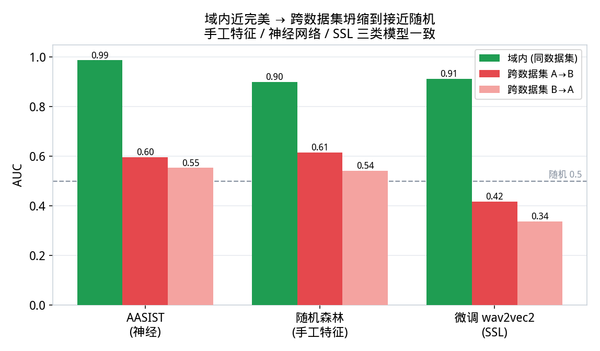

分数分布进一步说明,问题不只是阈值没调好。域内测试时,真唱和 AI 翻唱的分数分布清晰分离;跨数据集后,两类样本大量重叠,甚至出现排序方向错误。若排序本身已经错乱,单纯重标定阈值无法恢复 AUC。

**图 2. 检测分数分布。** 域内真假分离清晰,跨域后分布重叠。

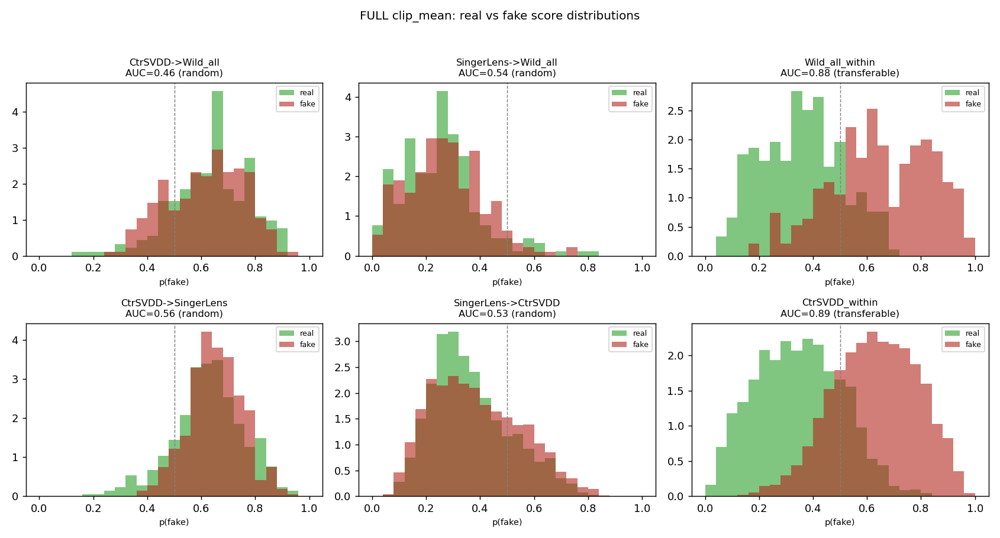

因此,本文的主线不是“训练一个更强检测器”,而是“审计检测器到底学到了什么”。接下来的章节沿着这条线推进:先确认崩塌,再拆解原因,随后尝试修复,最后给出可部署但克制的方案。

---

## 2. 相关工作与实验设置

在正式进入审计之前,需要先说明本文站在什么研究背景上,以及实验中到底比较了哪些数据、特征和检测器。这样后面的“崩塌”才不是孤立现象,而是对现有 SVDD 评测方式的一次压力测试。

### 2.1 语音与歌声深度伪造检测

语音深度伪造检测长期受到 ASVspoof 等评测推动,研究对象包括文本转语音、语音转换、重放攻击和神经声码器伪迹。AASIST 等模型已经能在标准语音伪造基准中取得很强表现。歌声深伪检测与普通语音不同:歌声包含持续音、高频颤音、音高轨迹、声区变化、情感表达和音乐制作链路,这些因素会让“真伪”与“歌手身份”“歌曲风格”“平台后期”缠在一起。

因此,SVDD 不能只问“模型在随机划分测试集上能不能分开真假”,还要问“模型换到新歌手、新歌曲、新生成器、新平台后是否仍然有效”。这也是本文把跨数据集评测作为主线的原因。

### 2.2 跨域泛化与评测混杂

许多深伪检测研究已经指出,域内随机划分容易高估真实部署性能。训练集和测试集若共享相同生成器、声码器、录音链路或压缩方式,模型可能只学到数据集特有签名。这样的签名在域内稳定,所以指标很高;但它们并不等于真实的伪造语义,一旦换域就可能失效。

本文的贡献不是再报告一个更高的域内分数,而是系统审计“高分从哪里来”。我们把标准 SVDD 检测器放到跨数据集、留一生成家族、制作扰动和少量目标域适配的设置中,观察它是否真正抓住了可迁移线索。

### 2.3 数据、特征与模型家族

实验使用公开数据与自建 SingerLens 数据共同构成评测环境。自建数据包含 6 位歌手、3 首歌、共 1085 个 10 秒片段,其中 552 个为真唱,533 个为 Seed-VC 生成的 AI 翻唱。真唱来自公开演唱视频,经 Demucs 人声分离后切片;AI 翻唱以对应歌手的高质量片段作为目标音色生成。

检测器覆盖三类代表性方法。第一类是可解释手工声学特征加随机森林,特征包括 MFCC、HNR、F0 jitter、颤音深度、能量动态等。第二类是 AASIST 这类神经反欺骗模型。第三类是微调 wav2vec2 / wav2vec2-large 的自监督语音模型。这样的设置可以避免结论只依赖某一种模型。

### 2.4 SVDD-Audit 审计协议

SVDD-Audit 是本文整理出的实验协议集合,目标是让“检测器学到了什么”变得可检查。它包括:

- 跨数据集迁移:检验域内高分是否能迁移到另一数据集。
- copy-synthesis:让真唱也经过同一声码器,排除纯声码器假说。
- LOVO / LOGO:分别留出声码器家族和生成范式,观察未见生成管线的退化。
- 因子化控制:固定声码器或生成范式,只改变另一个轴。
- 特征归因与制作扰动:定位模型依赖的声学维度。
- MSA / U-MSA:评估少量目标域标签和主动选样能否提供部署出口。

---

## 3. 初步审计:跨数据集崩塌不是偶然

如果一个方法只在单个模型或单个数据集上失败,它可能只是工程细节没做好。我们首先要证明,跨数据集崩塌是 SVDD 评测中的系统性问题。为此,我们比较了不同模型家族、不同迁移方向和不同数据来源,并观察分数分布而不仅是最终 AUC。

实验结果显示,域内高分会严重高估真实泛化能力。模型在源域中学到的判别边界,迁移到目标域后不再对应真假标签。这个发现改变了项目方向:我们不再把高分当作成功,而是把它当作需要解释的现象。

这种转向很关键。一个“完美”的域内 AUC 可能来自真实的 AI 痕迹,也可能来自数据集特有的制作流程。如果训练集中的 AI 样本恰好更干净、更窄带或来自固定生成链路,检测器就能用这些捷径取得高分。一旦目标域的制作条件变化,同一条捷径就会失效。

---

## 4. 诊断:检测器到底依赖了什么

跨域失败说明检测器学到了不稳定线索,但“不稳定线索”本身仍然太笼统。本章用一组排除式实验追问这些线索具体来自哪里:是声码器,是生成范式,是频谱带宽,还是语言差异。

### 4.1 排除“声码器探测器”假说

最直接的解释是:AI 翻唱都经过声码器,检测器可能只是认出了声码器指纹。为了检验这一点,我们设计 copy-synthesis 对照实验:把真人录音也送入同一个 NSF-HiFiGAN 声码器重渲染,观察它是否会被判成假。

结果是否定的。真唱经过同一声码器后,判假率约为 14.4%,与自然真唱的 16.7% 接近,远低于真实 AI 翻唱的 83.3%。这说明检测器不是一个简单的声码器探测器。声码器参与了制作链路,但它不是全部原因。

**图 3. Copy-synthesis 对照。** 真唱经过同一声码器后并未大规模被误判为 AI。

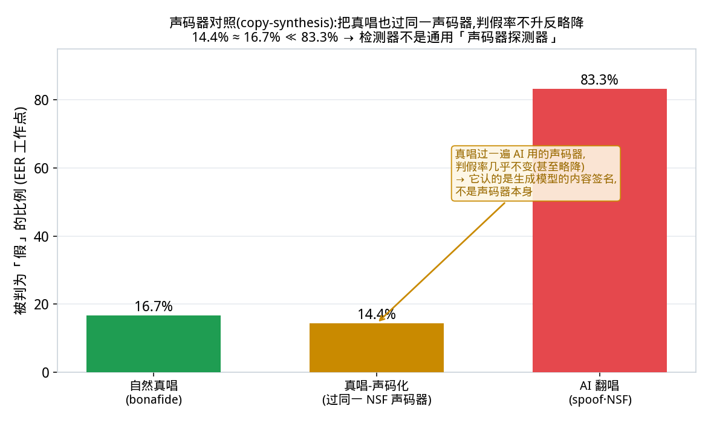

### 4.2 排除“单一生成家族”假说

第二个假设是,检测器只是在记某个生成家族。我们用留一声码器(LOVO)和留一生成范式(LOGO)做验证:训练时剔除某类声码器或某类生成范式,测试时专门考察被留出的类型。

结果显示,未见过的声码器或生成范式都会让 EER 明显升高。AASIST 面对未见 NSF-HiFiGAN 时,EER 可升高约 3 倍;面对未见 SVS 或 SVC 范式时,EER 退化约 2.4 到 3.0 倍。这说明检测器确实依赖生成家族,但仍不能区分声码器和生成范式各自贡献了多少。

**图 4. LOVO/LOGO 退化。** 未见生成家族导致性能明显下降。

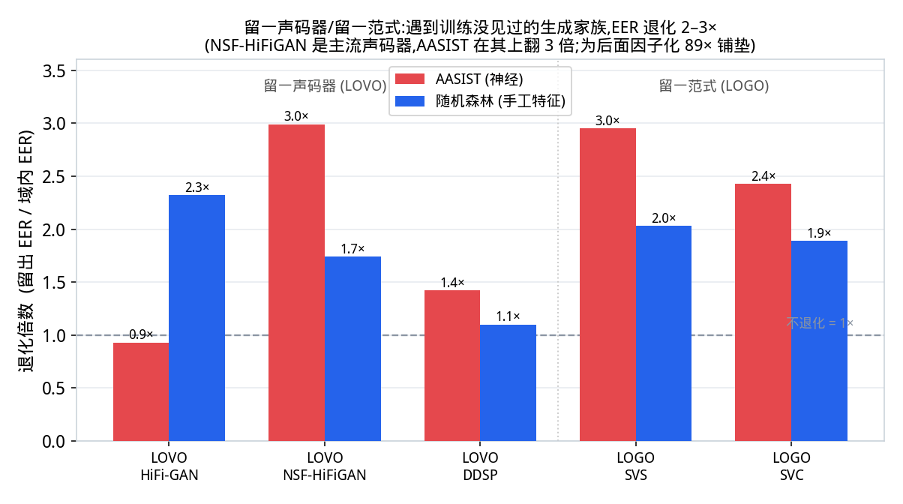

### 4.3 关键转折:生成范式和声码器是两个独立混杂轴

为了解开声码器与生成范式的纠缠,我们做了因子化实验:固定一个轴,只改变另一个轴。NSF-HiFiGAN 恰好横跨不同生成范式,为“声码器不变,只换范式”提供了观察窗口。

结果给出了全文第一个强转折:即便声码器完全相同,只改变生成范式,EER 也能从约 1% 飙升到约 50%,退化最高达 89 倍。这比单纯更换声码器还严重。由此可见,检测器依赖的不是单一指纹,而是“生成范式 × 声码器 × 制作流程”共同形成的签名。

| 对照 | 固定因素 | 留出因素 | 退化幅度 |
|---|---|---|---:|
| 换声码器 | 生成范式 | 声码器 | 12.8x / 28.8x |
| 换生成范式 | NSF 声码器 | 生成范式 | 59x / 89x |
| AASIST 换生成范式 | NSF 声码器 | 生成范式 | 13.6x |

**图 5. 因子化退化。** 固定声码器、仅改变生成范式时退化可达 89 倍。

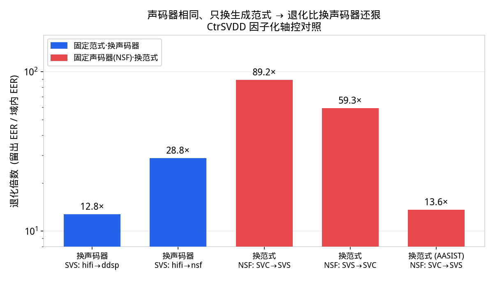

### 4.4 物证一:源域模型押错了特征

为了把“制作签名”落到可观察的声学维度,我们做了特征归因。源域模型主要依赖高阶 MFCC 等频谱纹理特征,几乎不使用 HNR;而目标域内训练的模型更重视 HNR。HNR 更接近嗓音质量和谐噪比,在目标域中才是真正有用的真假线索。

换言之,源域模型在目标域失败,不是因为它完全没有学到东西,而是因为它学到了错误方向。它沿着 MFCC 纹理排序样本,但目标域中真假差异更多体现在 HNR 等线索上。源域模型对目标域样本的错误排序与 `mfcc_13_std` 的相关系数达到 0.55,进一步支持这一判断。

**图 6. 特征归因错位。** 源域模型依赖 MFCC,目标域模型更重视 HNR。

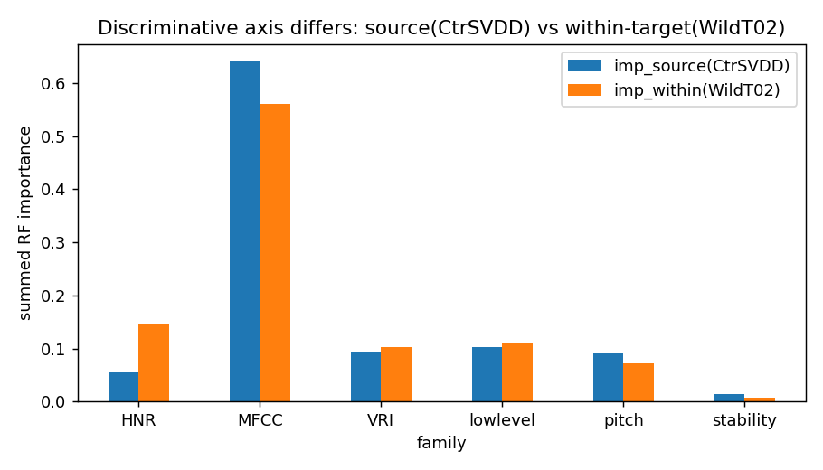

### 4.5 物证二:只改变制作外壳就能让真人变“AI”

如果检测器依赖制作签名,那么只改真人音频的制作外壳,不改歌手、歌词和演唱内容,也应该能改变模型判断。我们对真唱样本施加带限、低通、重采样、MP3 压缩、加噪和响度变化。

结果显示,带限和 MP3 压缩会显著提高真唱的“伪造分数”,使 13% 到 47% 的真唱被误判为 AI;加噪和改响度几乎没有影响。这说明检测器敏感的不是普通音质劣化,而是特定的频谱带宽、编解码和人声分离足迹。

### 4.6 物证三:6-7kHz 是误判临界点

我们进一步连续扫描低通截止频率,观察真唱被误判为 AI 的比例。翻转率在 6-7kHz 附近陡升,3-6kHz 形成危险区间。这个区间恰好与平台转码、人声分离和二次传播常见的频谱损伤区间重合。

这一步很重要,因为它把“制作签名”从一个抽象判断变成了可定位的频带现象。检测器不是简单地讨厌低质量音频,而是在某个中等带宽区间把真唱推向 AI。

**图 7. 带宽扫描。** 真唱误判在 6-7kHz 附近出现明显临界点。

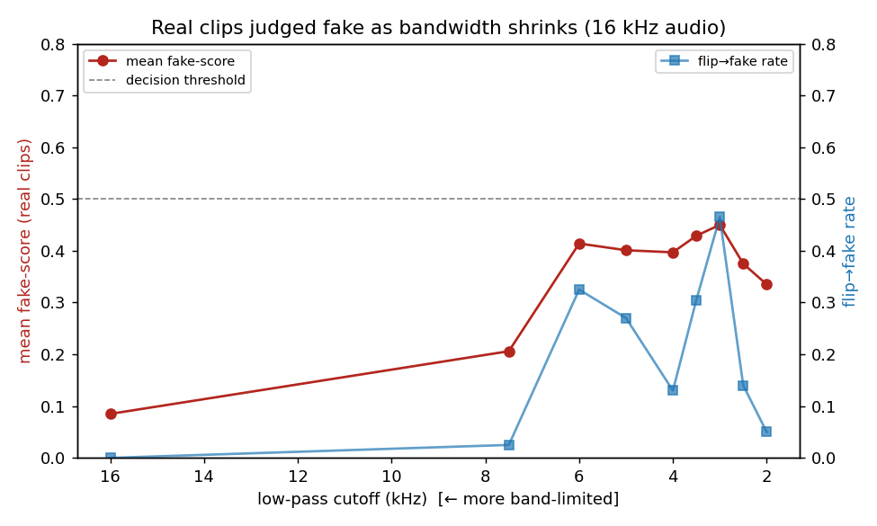

### 4.7 物证四:三语种实验排除中文特例

为了排除“这只是中文或声调语言特有现象”,我们在普通话、粤语和英文真唱上施加同类带限扰动。英文样本虽规模较小,但翻转比例与中文相近,甚至在部分设置下更高。

因此,带限导致误判不是中文语音结构的偶然结果,而是更一般的音频制作问题。模型捕捉到的是语言无关的频谱足迹。

**图 8. 三语种翻转。** 普通话、粤语和英文都出现带限导致的真唱误判。

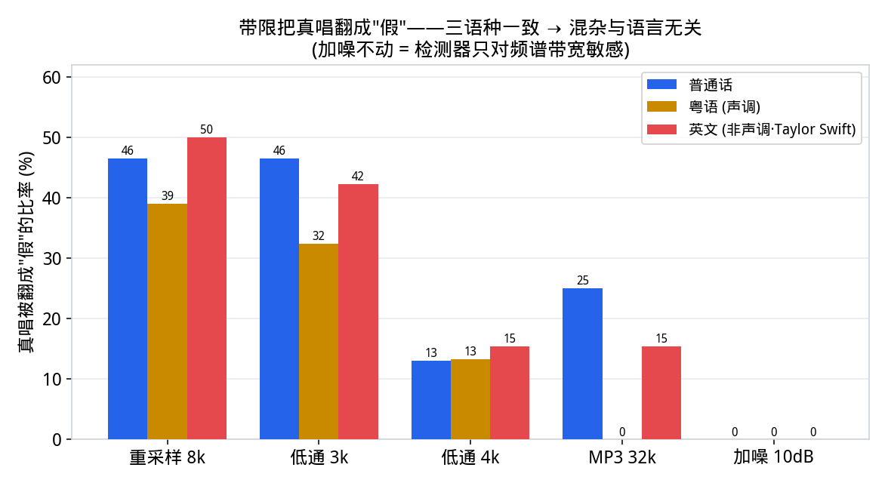

本章的结论是:检测器学到了一条“制作干净度/频谱带宽”判别轴。它在单个数据集内部恰好与真假标签相关,但一旦换平台、换生成流程或换后处理链路,这条轴就不再可靠。

---

## 5. 修复尝试:免标注方法为什么都不够

定位到问题后,最自然的目标是修复它。我们首先尝试不依赖目标域标签的方法,因为这类方法最符合“训练一次,到处部署”的理想。如果它们成功,SVDD 可以继续被看作一个通用分类问题;如果它们失败,我们就必须承认每个新平台都需要本地适配。

### 5.1 无监督域适应不能修正错误判别方向

CORAL、子空间对齐和 DANN 等方法试图对齐源域与目标域特征分布,但实验 AUC 仍停留在 0.44 到 0.62,有时比不适应更差。原因在于,它们对齐的是边缘分布,而我们真正遇到的问题是判别方向错了。若模型把 MFCC 制作纹理当成真假轴,仅让两域特征看起来更像并不能恢复正确排序。

### 5.2 统一带宽和产线随机化只能削弱部分捷径

我们也尝试直接处理带宽轴:对所有数据统一低通或重采样,以及在训练中随机加入带宽、编解码和重采样扰动。结果仍然接近随机。产线随机化确实把模型从 MFCC 捷径上略微推开,但没有让它学到可跨域的真伪线索。

### 5.3 统一声码器反而暴露更深的内容签名

如果声码器是主要问题,那么把真唱和 AI 翻唱都送入同一个 NSF-HiFiGAN 重合成,应该能抹平差异。事实相反:域内可分性几乎不变,MFCC 依赖甚至上升。这说明真正撑起高分的不是声码器本身,而是生成模型在 mel 频谱中留下的内容指纹;声码器只是把这个指纹重新渲染出来。

**图 9. 免标注修复失败。** 多种无标签修复方法仍贴近随机带,只有目标域监督显著提升。

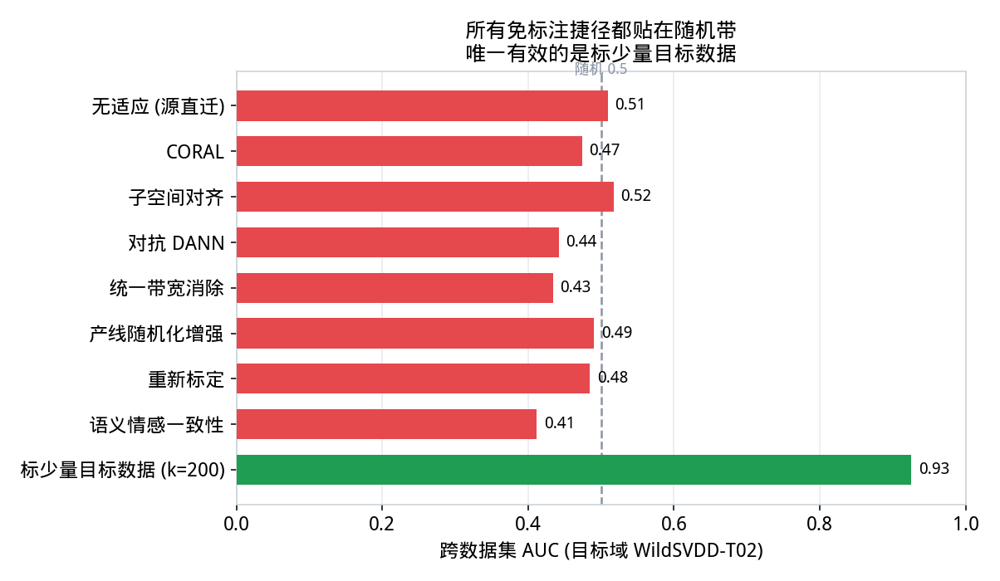

**图 10. 去混杂机制。** 随机化和统一声码器不能稳定移除生成内容签名。

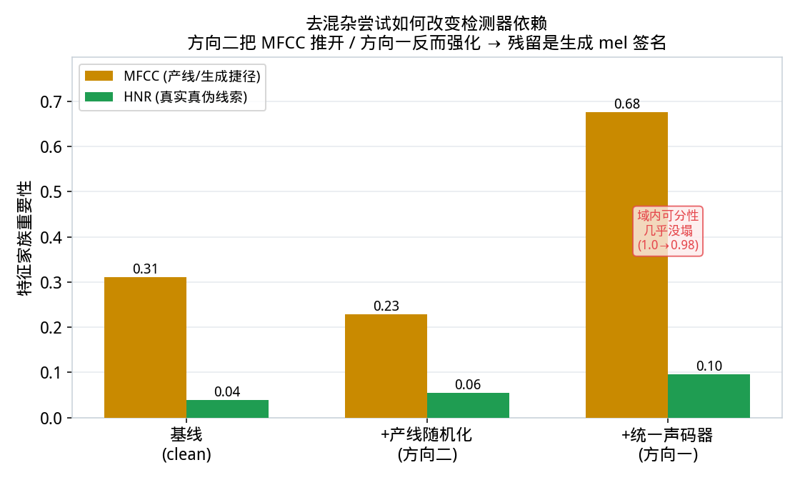

### 5.4 情感一致性也不是跨域银弹

我们还构造了一条看似更“语义”的线索:歌词情感与演唱情感是否一致。域内结果支持直觉,真人演唱的歌词-演唱情感一致性高于 AI 翻唱。但当这个线索被用于跨域检测时,AUC 从 0.679 跌到 0.412,低于随机。

这说明换一条更高级的线索不等于解决泛化。语义线索同样会受数据来源、歌曲类型、情感模型和演唱风格影响。它适合作为案例解释工具,不适合作为免标注跨域检测器。

**图 11. 情感一致性。** 域内有解释价值,跨域作为检测信号会反转。

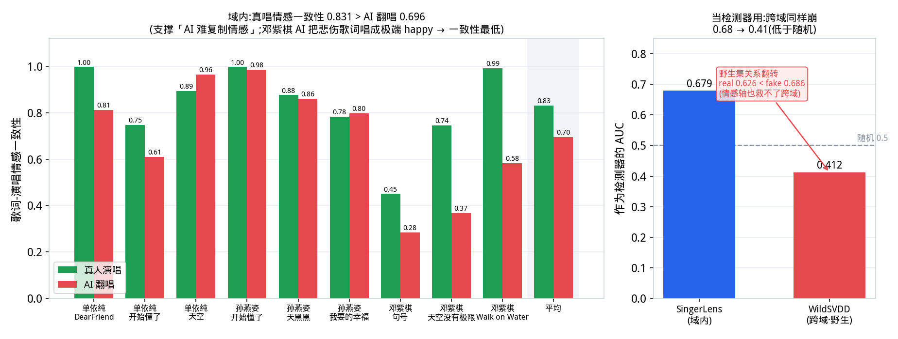

这一章的负结果不是失败记录,而是证据链的一部分。它们共同说明:SVDD 的跨域问题不能靠单一归一化、单一增强或单一替代线索解决。真正困难的是不同生成系统在内容表示和制作链路上留下的签名天然不同。

---

## 6. 唯一有效的出口:最小监督适配与 U-MSA

既然免标注修复不稳定,我们把问题改写为一个更现实的部署问题:每到一个新平台,最少需要多少目标域标签?这些标签应该随机标,还是应该优先标最有价值的样本?

### 6.1 MSA:少量目标域标签就能改变判别轴

最小监督适配(MSA)的做法很直接:在目标域中标注少量样本,重新训练或校准检测器。实验显示,只用 10 个目标域标签,AUC 就能达到 0.63,已经超过所有免标注方法;100 个标签达到 0.86,200 个标签达到 0.91,全量目标域训练达到 0.93。

| 标签数 k | 10 | 30 | 50 | 100 | 200 | 全量 |
|---|---:|---:|---:|---:|---:|---:|
| AUC | 0.63 | 0.77 | 0.82 | 0.86 | 0.91 | 0.93 |

**图 12. MSA 学习曲线。** 收益主要集中在前几十个目标域标签。

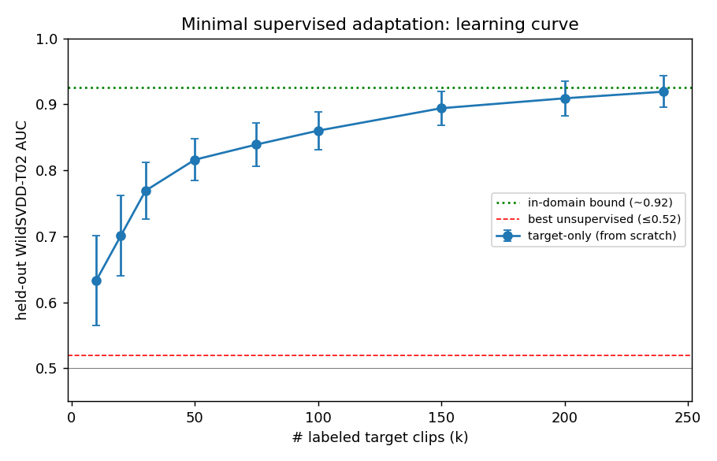

MSA 的意义不只是 AUC 上升。特征归因显示,50 个标签后,HNR 权重从源域的 0.055 升至 0.123,接近目标域内模型的 80%;MFCC 权重则从源域虚高的 0.642 回落到约 0.56。这说明少量目标域监督把模型从源域制作捷径拉回了目标域中真正有效的声学线索。

### 6.2 U-MSA:让有限标签用在最有信息量的样本上

MSA 有效,但仍需要人工标注。我们进一步提出不确定性主动选择(U-MSA):优先选择当前模型最犹豫、最靠近决策边界的样本去标注,而不是随机抽样。

在 WildSVDD-T02 上,U-MSA 达到 AUC 0.90 只需约 150 个标签,随机抽样需要约 200 个标签,节省约 25%。多随机种子实验显示,在中高预算(k >= 100)下,U-MSA 相对随机的配对胜率达到 0.92。机制分析也符合预期:U-MSA 选中的样本确实更靠近决策边界。

**图 13. U-MSA 稳定性。** 中高预算下不确定性选择稳定优于随机选择。

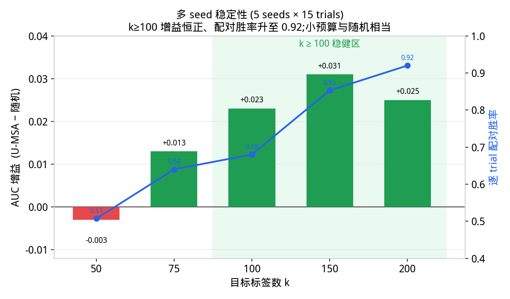

**图 14. U-MSA 机制。** U-MSA 选中的样本更靠近决策边界。

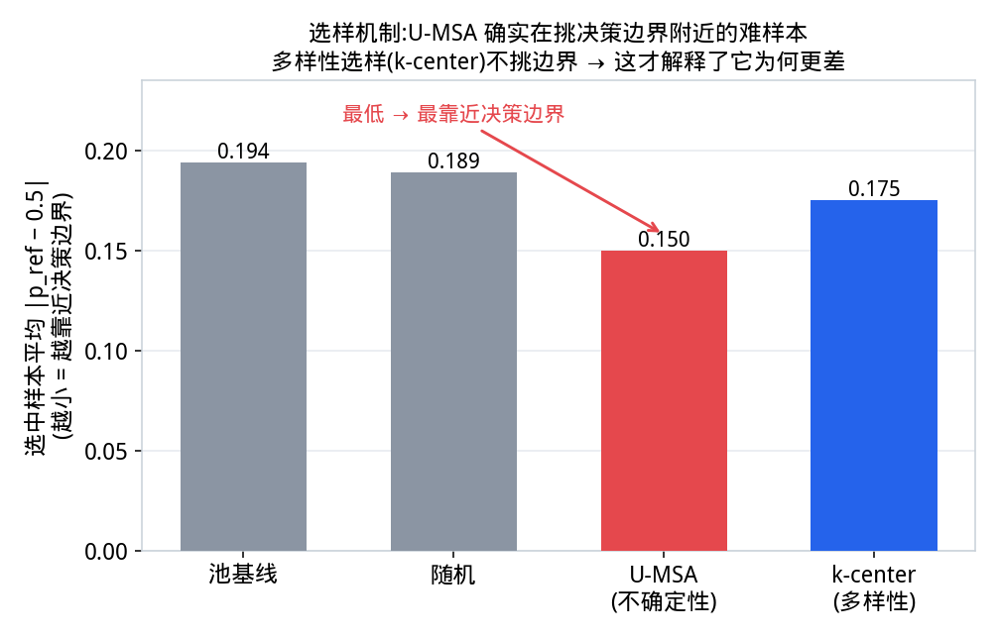

### 6.3 第二目标域复验:方向成立,幅度更克制

为了避免 U-MSA 只在单一目标域上成立,我们在 CtrSVDD 作为第二目标域的设置中复验。结果显示,U-MSA 仍优于随机,但增益更温和:k=50 时提升 0.044 AUC,k=100 时提升 0.015,k=200 时提升 0.007。

| CtrSVDD 目标域 | k=50 | k=100 | k=200 |
|---|---:|---:|---:|
| 随机均衡选样 | 0.644 | 0.734 | 0.778 |
| U-MSA 不确定性选样 | 0.688 | 0.749 | 0.785 |
| 提升 | +0.044 | +0.015 | +0.007 |

这个复验给出了更诚实的结论:U-MSA 不是保证节省 25% 标签的定律,而是一种在多数预算下比随机更合理的标注策略。它的收益取决于目标域难度、样本结构和初始模型的边界质量。

---

## 7. SingerLens:从审计结论到可展示系统

前面的实验回答了“检测器为什么会失败”和“如何更现实地修复”。SingerLens 则把这些结论落到一个可展示的系统和工具包中:它既包括自建数据集、特征提取和检测器训练,也包括面向演示的 Gradio 界面。

### 7.1 自建数据集

我们构建了 6 位歌手、3 首歌、共 1085 个 10 秒片段的数据集,其中 552 个真唱片段来自 B 站公开演唱并经 Demucs 人声分离,533 个 AI 翻唱片段由 Seed-VC 生成。另有真唱经同一声码器重渲染的对照集,用于 copy-synthesis 实验。

这套数据最初用于做一个可解释的 AI 翻唱检测器,但它最终反而暴露了“满分”的可疑来源。当我们第一次观察到 AUC=1.0 时,没有把它直接当作成功,而是继续追问:这个满分来自真伪差异,还是来自制作流程差异?这正是 SingerLens 走向 SVDD-Audit 的起点。

**图 15. 数据集组成。** 6 位歌手、3 首歌、真唱与 AI 翻唱片段共同构成实验基础。

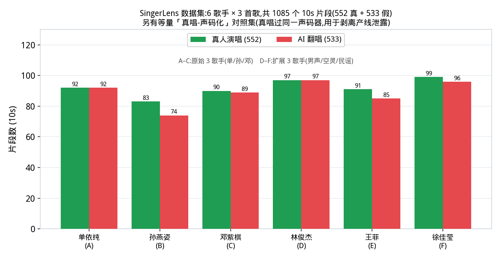

### 7.2 Demo 与交互式解释

Gradio Demo 支持上传或选择歌声音频,输出真假概率、置信度、特征异常和可视化解释。它的价值不只是展示一个检测结果,而是能把报告中的核心现象变成可观察过程:同一段真唱经过低通或压缩后,伪造分数会发生明显变化。

**图 16. SingerLens Demo 真实运行对照。** 取同一首歌(单依纯《DearFriend》)的**同一段**真唱与其 AI 翻唱跑通实际界面,二者歌词相同(Whisper 识别为“我唱着一首歌在想你忽然闪现眼神迷离”),仅真伪不同,构成公平对照。上图为真唱,系统判为“倾向真实演唱”(真实性评分 87.7/100,AI 翻唱概率 12.3%),风格画像贴近真人均值、异常时间轴全程低位;下图为 AI 翻唱,系统判为“疑似 AI 翻唱”(AI 翻唱概率 95.3%),画像偏向 AI 均值、时间轴全程高位。两图均完整展示检测分数、置信度、风格画像雷达、逐维异常表与情感一致性面板;尤其在情感面板上,真唱演唱情感为 other/sad(valence −0.36),而 AI 翻唱被唱成极端 sad(valence −1.00),与第 5.4 节“AI 难复制情感微表达”的观察一致。

*（a）真唱片段 → 倾向真实演唱(真实性 87.7/100)*

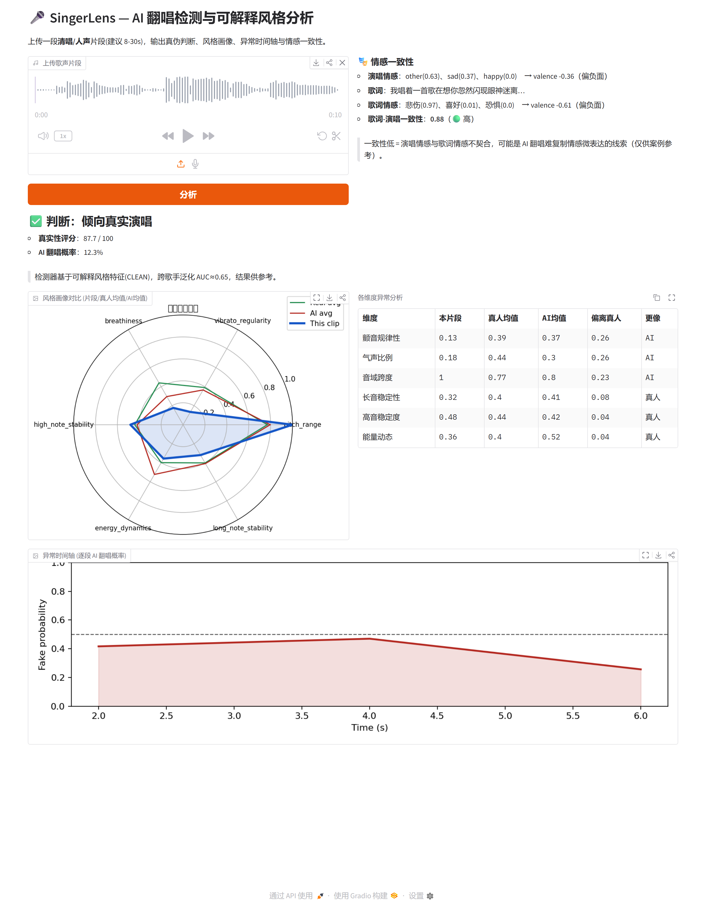

*（b）AI 翻唱片段 → 疑似 AI 翻唱(AI 概率 95.3%)*

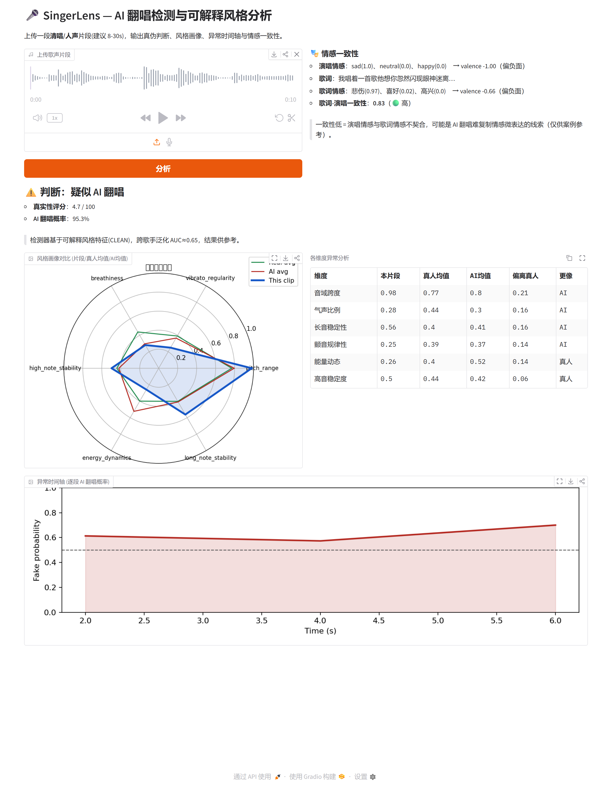

Demo 因此不是独立于论文的工程附属品,而是论点的交互式呈现。它帮助观众看到:检测器并非稳定地理解“AI 歌声”,而是在具体制作条件变化时发生判断漂移。

### 7.3 审计工具包

我们同时整理了 SVDD-Audit 工具链,覆盖跨数据集评估、copy-synthesis、LOVO/LOGO、因子化实验、特征归因、带宽扰动、MSA 和 U-MSA。它让队友可以继续扩展目标域、复现实验或加入新的生成系统。

---

## 8. 讨论与局限

本文的结论需要放在清楚的边界内理解。我们证明的是“域内高分不能直接代表跨域可用”,以及“少量目标域监督是当前更现实的出口”。这不等于说所有 SVDD 检测器都只能学习制作签名,也不等于说 U-MSA 在所有平台上都能固定节省 25% 标签。更准确的表述是:在我们覆盖的公开数据、自建数据和第二目标域复验中,制作签名是主要混杂来源,而 U-MSA 是比随机标注更稳妥的预算分配方式。

数据层面仍有限制。英文三语种验证的样本量较小,更适合作为排除“中文特例”的补充证据,不能单独支撑跨语言普遍结论。自建 SingerLens 数据覆盖 6 位歌手和 3 首歌,足以暴露制作签名问题,但仍不能代表所有音乐风格、录音条件和生成器版本。

方法层面也要克制。MSA 需要目标域标签,这意味着真实部署中仍然存在标注成本;U-MSA 依赖初始模型能给出有意义的不确定性,在极端域偏移下可能退化。未来更值得推进的方向包括更轻量的目标域采样协议、跨平台持续监测、源域与目标域联合学习,以及面向新生成器的在线审计流程。

### 8.1 有价值但非主线的发现

部分实验没有成为主线结论,但它们帮助解释 SVDD 为什么困难。我们把这些内容放入附录式讨论,避免干扰主线,同时保留项目深度。

### 8.2 窗级时序检测的反转

我们曾尝试用窗口级 MIL 捕捉局部 AI 痕迹,希望“只要某个片段像 AI,整段歌就可疑”。但跨歌手实验中,AUC 反而下降。原因是窗口最大化不仅抬高假唱分数,也抬高了真唱分数,造成看似更敏感、实际更混乱的拾分假象。

**图 17. 窗级 MIL。** 局部最大化未带来稳定跨域收益。

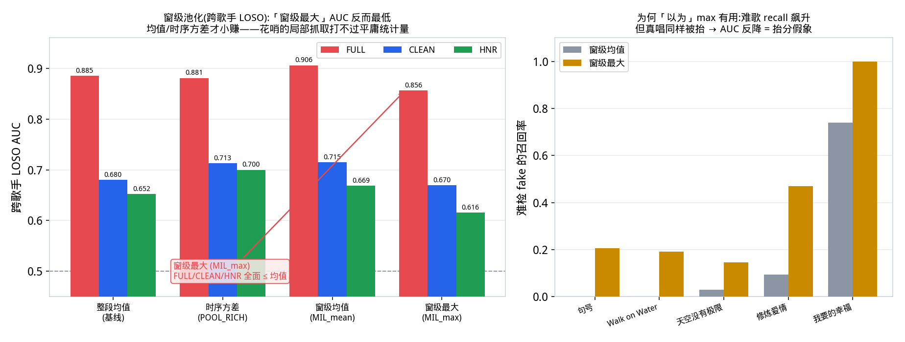

### 8.3 难度分层与颤音线索

难度分层显示,易检 fake 往往存在更夸张的颤音深度;最难检 fake 则集中在悲伤、慢歌等情绪和声学变化较小的片段中。这说明“AI 痕迹”不是均匀分布在所有歌曲和所有歌手上,而会被风格、情绪和演唱难度调制。

**图 18. 难度分层。** 不同歌曲和演唱风格影响检测难度。

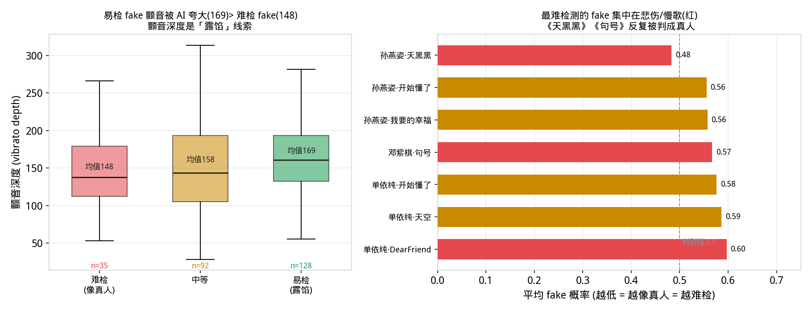

### 8.4 方差分解:谁在唱比是否 AI 更强

方差分解显示,不少声学特征的主要方差来自“谁在唱”,而不是“是否 AI”。这解释了为什么跨歌手、跨平台、跨制作流程泛化都困难:模型很容易把身份、风格和录音条件当成真伪线索。

**图 19. 方差分解。** 特征变化很大一部分由歌手身份解释。

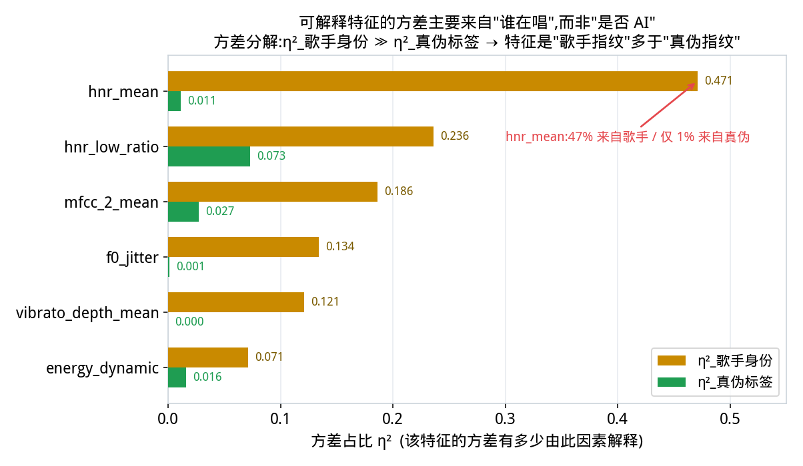

### 8.5 满分幻觉与简单方法的边界

域内满分不等于泛化成功。我们用 illusion/full 和 simple-vs-complex 对比提醒:复杂模型不一定自动解决混杂,简单 per-singer 归一化有时反而比复杂对抗方法更稳。方法复杂度不是关键,关键是评测协议是否暴露了真实部署中的域变化。

**图 20. 满分幻觉。** 域内表现可能掩盖跨域失败。

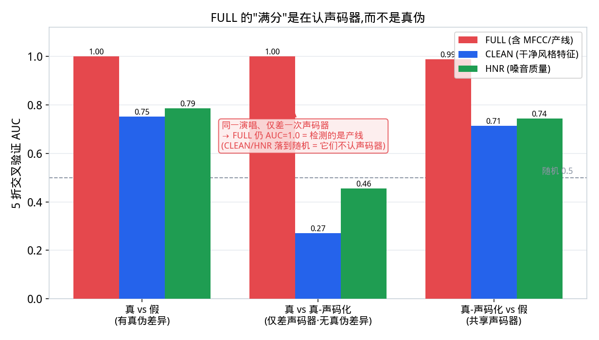

**图 21. 简单与复杂方法对比。** per-singer 归一化等简单修正有时优于复杂对抗方法。

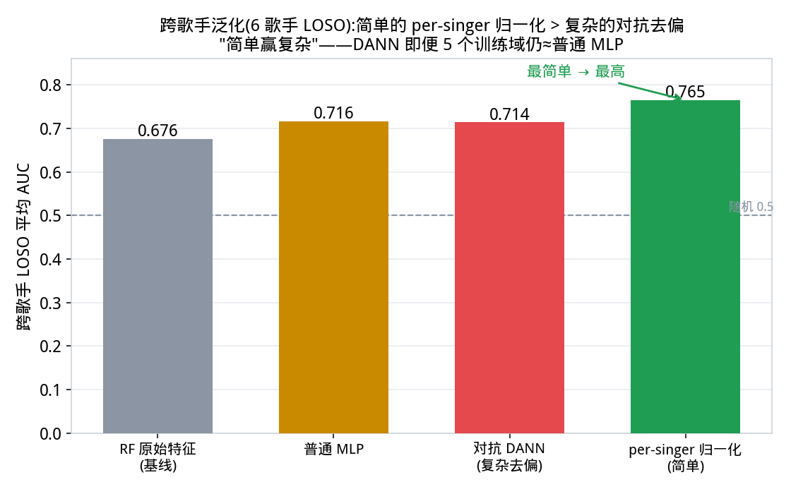

---

## 9. 结论

本项目从一个反常现象出发:SVDD 检测器在公开基准上接近满分,但跨数据集后接近随机。围绕这个反差,我们完成了从现象复现、原因诊断、负结果排除到可行修复的完整审计链。

第一,基准高分严重高估了真实泛化能力。手工特征、AASIST 和自监督模型都会在跨数据集设置中崩塌,说明问题不属于某一个模型家族。

第二,检测器依赖的是制作签名,而不是稳定的 AI 本质。copy-synthesis 排除了纯声码器解释;LOVO/LOGO 和因子化实验说明生成范式与声码器是两个独立混杂轴;特征归因、带宽扫描和三语种实验进一步把问题定位到频谱带宽、制作干净度和生成内容指纹。

第三,免标注修复没有稳定解决方案。无监督域适应、统一带宽、产线随机化、统一声码器、阈值重标定和情感一致性线索都无法可靠恢复跨域排序。这些负结果迫使我们接受一个更务实的结论:每个新平台都应被视为一个新目标域。

第四,最小监督适配是当前最可信的部署出口。少量目标域标签能够把模型拉回目标域真实判别轴,U-MSA 则让标注预算优先投入边界附近的高信息样本。第二目标域复验表明,这种策略方向成立,但收益幅度取决于目标域,报告中必须克制表述。

最终,SingerLens 的价值不在于宣称“我们做出了通用 AI 歌声检测器”,而在于提出了一套更诚实的评测和部署原则:任何 SVDD 系统在上线前都应进行跨数据集审计、制作签名检查和少量目标域适配。否则,域内高分很可能只是捷径学习制造出的幻觉。

---

## 附录:产物与复现材料

- `svdd_audit/`: 审计脚本与实验协议,包括 copy-synthesis、LOVO/LOGO、因子化、带宽扰动、MSA 和 U-MSA。
- `svdd_audit/results/`: 关键 CSV 与图表结果。
- `svdd_audit/docs/`: 发现记录与实验说明。
- `report_figures/`: 本报告使用的 21 张图。
- `README.md` 与 `EXPERIMENTS_NEXT.md`: 队友继续复现实验和扩展目标域的入口。
